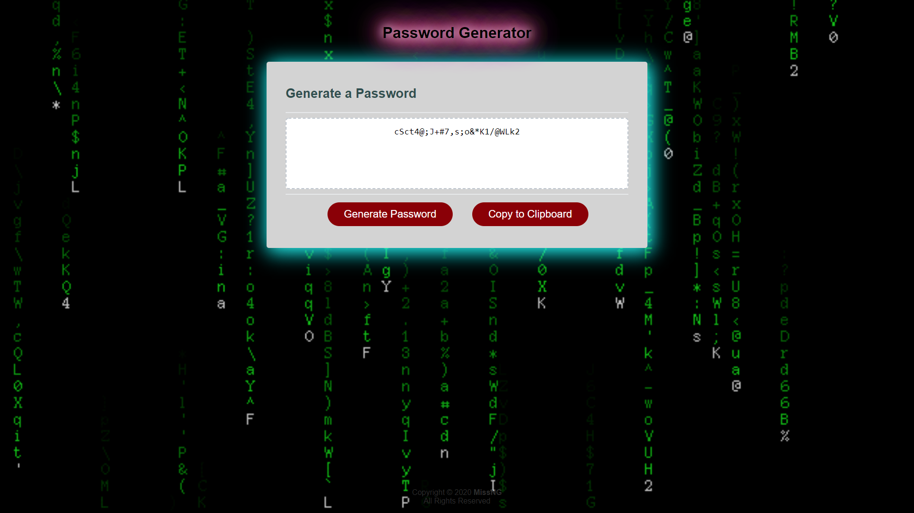

# 03 JavaScript: Password Generator

**[MissNG Password Generator](https://missng-git.github.io/BCS_PW-Generator/)**

This application was created to generate a random password based on criteria a user has selected by modifying a starter code. This app will run in the browser, and will feature dynamically updated HTML and CSS powered by the included JavaScript code. I have kept the user interface polished and responsive, ensuring that it adapts to multiple screen sizes, only adding in a few special styles (like a gif background and some glow elements) to characterize individuality.

The password is restricted to be between 8 - 128 characters, and can include special characters. If you’re unfamiliar with these, see this [list of Password Special Characters from the OWASP Foundation](https://www.owasp.org/index.php/Password_special_characters).

## Objectives

```
+ Randomly generate a password that meets user-requested criteria
+ Generate passwords to be inclusive of special characters (OWASP Foundation) where reqeusted
+ Include a copy button to allow ease of copying password to clipboard for pasting elsewhere
+ Allow users to create strong passwords for greater account security
+ Ensure user experience is intuitive and easy to navigate by providing a clean & polished look

```

## Target Design

The following image shows the web application's appearance and functionality:



### Overview of Code Functionality

1. Application's "Generate Password" button function correctly.

2. Application's 'prompt' feature successfully creates pop-up to request password criteria and alert where invalid entry has occurred.

3. Application's criteria parameters are set to be a minimum of 8 characters long but no more than 128 characters maximum.

4. Application accurately registers user input for password criteria (_ie lowercase, uppercase, numeric, and/or special characters_), and validates response to include in generated password.

5. Application successfully generates a password that matches the selected criteria and displays the password on the page, free of errors at the front (on-screen to user) or back-end (in console) of web page.

6. Application's "Copy to Clipboard" button function correctly.

### Usability

- Click on "Generate Password" button.

- Enter desired length of password.
  _**NOTE:** Minimum length of password is 8 characters and Maximum length is 128 characters._

- Enter password criteria when prompted (_ie lowercase, uppercase, numeric, and/or special characters_): Click 'OK' if password parameter desired, otherwise 'Cancel'.

- Password will be generated and displayed directly on web page for you to jot down or...

- Click on "Copy to Clipboard" button to automatically copy the password for ease of pasting into desired application/website 😎
